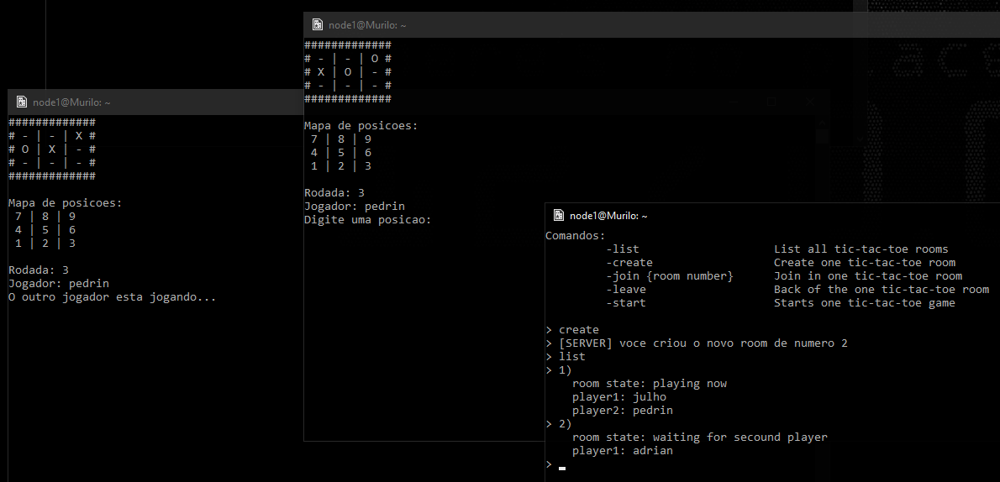

<h1 align="center"> Simple Tic-Tac-Toe Overview </h1>

[]()

- Singleplayer :heavy_check_mark:
- Multiplayer :heavy_check_mark:
- Also, you can write by opening an Issue and also solve a current issue if possible.
- Fork this project to your Github acoount.
- This software is created under [MIT License](https://google.com.br/)

To start the server and client: 
```bash
$ make
$ ./server [server_port]
$ ./game
```

Game and client:


Player 1 creates the lobby, and player 2 enters:


When it's your turn, choose an option from the board for your move ... for you, you will always be X


When either player wins the match, they return to the online menu


Thus, other players can create more rooms to play



